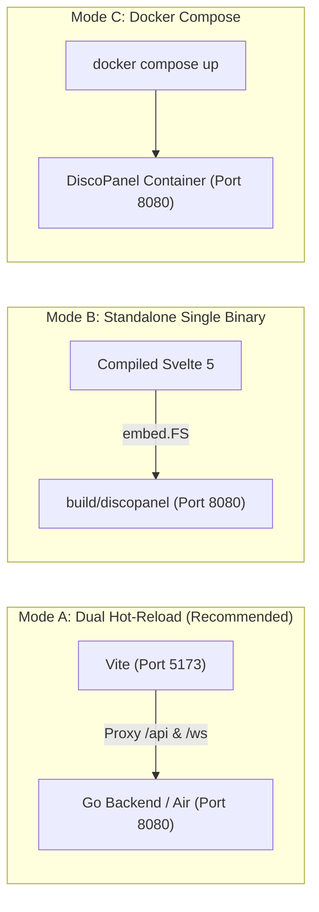

# DiscoPanel Rapid Development Playbook

> **The definitive developer guide for friction-free local development, live debugging, schema generation, and system operations.**  
> Target: **Go 1.24+** | **Svelte 5 (Runes)** | **ConnectRPC v1** | **SQLite WAL** | **Docker Engine**

---

## 1. 60-Second Quickstart

### Prerequisites Check
Run the automated pre-flight checker to verify all required compilers, runtimes, and ports:

```powershell
# Windows (PowerShell)
.\scripts\dev-check.ps1
```

```bash
# Linux / macOS (Bash)
./scripts/dev-check.sh
```

### One-Click Launch (Dual Dev Mode)
Launch the Go backend daemon and Svelte 5 frontend with hot reloading in a single command:

```powershell
# Windows (PowerShell)
.\scripts\dev-start.ps1
```

```bash
# Linux / macOS (Bash)
./scripts/dev-start.sh
# or using Makefile:
make dev
```

### Accessing the Local Stack
| Service | URL / Endpoint | Purpose |
| :--- | :--- | :--- |
| **Frontend Web App (HMR)** | [http://localhost:5173](http://localhost:5173) | Vite dev server with Svelte 5 hot-module reloading |
| **Backend ConnectRPC API** | [http://localhost:8080](http://localhost:8080) | Go daemon HTTP/2 h2c, gRPC, and REST routes |
| **Minecraft Smart Reverse Proxy** | `localhost:25565` | L4/L7 SNI handshake proxy for server containers |
| **API Reflection & Docs** | [http://localhost:8080/api/v1/openapi.yaml](http://localhost:8080/api/v1/openapi.yaml) | Dynamic OpenAPI v3 specification |

> **First Run Tip**: On first startup, navigate to `http://localhost:5173`. DiscoPanel will prompt you to create your initial administrator account.

---

## 2. Development Modes & Workflows

DiscoPanel supports three distinct development workflows:



### Mode A: Dual Hot-Reload Mode (Default)
Ideal for daily feature development. Frontend updates reflect instantly in the browser without reloading; backend changes reload automatically if [Air](https://github.com/air-verse/air) is installed.

```bash
# Start both automatically
./scripts/dev-start.ps1    # or ./scripts/dev-start.sh

# Or start in separate terminals:
# Terminal 1 (Backend):
go run cmd/discopanel/main.go   # or 'air' for live reload

# Terminal 2 (Frontend):
cd web/discopanel && npm run dev
```

### Mode B: Single Binary Production Simulation
DiscoPanel packages the entire compiled Svelte 5 SPA inside the Go binary using `embed.FS` (`web/discopanel/embed.go`). To test the true production artifact:

```bash
# 1. Build the frontend SPA
cd web/discopanel && npm run build && cd ../..

# 2. Compile Go binary with embedded assets
go build -o build/discopanel cmd/discopanel/main.go

# 3. Run the standalone binary
./build/discopanel
# Open http://localhost:8080 directly!
```

### Mode C: Docker Compose Integration
To test full container lifecycle, network isolation, and module sidecars:

```bash
# Build and run the local container stack
make dev-docker
# or:
docker compose up --build
```

---

## 3. VS Code & Delve Debugging Guide

Pre-configured `.vscode/` settings, tasks, and launch targets are included.

### Launch Configurations (`launch.json`)
Press `F5` in VS Code to run any of the following profiles:

1. **`Debug DiscoPanel (Go Backend)`**:
   - Launches `cmd/discopanel` under Delve (`dlv`).
   - Injects default local dev environment variables.
   - Allows setting breakpoints in ConnectRPC service handlers (`internal/rpc/services/`), Docker managers (`internal/docker/`), and background metric loops (`internal/metrics/`).
2. **`Debug Frontend (Chrome)`**:
   - Attaches Chrome debugger to `http://localhost:5173` with full TypeScript and Svelte 5 source maps.
3. **`Full Stack: Backend + Chrome Frontend`** *(Compound)*:
   - Launches both Go backend and Chrome frontend debuggers in a single click.
4. **`Debug Current Go Test`**:
   - Runs Delve against the currently opened Go test file.

### Key VS Code Tasks (`tasks.json`)
Press `Ctrl+Shift+B` or open the Command Palette (`Ctrl+Shift+P` -> `Tasks: Run Task`):
- **`Dev: Start All (Dual Mode)`**: Runs `scripts/dev-start.ps1` / `scripts/dev-start.sh`.
- **`Dev: Environment Pre-Flight Check`**: Runs `scripts/dev-check.ps1` / `scripts/dev-check.sh`.
- **`Go: Run All Tests`**: Executes `go test -v ./...`.
- **`Web: Type Check`**: Runs `svelte-check` against TypeScript definitions.
- **`Buf: Clean & Regenerate Protos`**: Compiles all `.proto` schemas.

---

## 4. Protobuf & Schema-First API (Buf v2)

DiscoPanel uses **protocol buffers v3** as the single source of truth for all API models, RPC service contracts, and WebSocket event payloads.

### Directory Mapping
```
proto/discopanel/v1/*.proto   <── Author schemas here
      │
      ├── (Buf Go Plugin)     ──> pkg/proto/discopanel/v1/*.pb.go
      │                           pkg/proto/discopanel/v1/*connect.go
      │
      └── (Buf ES Plugin)     ──> web/discopanel/src/lib/proto/*.ts
```

### Regenerating Schema Stubs
Whenever you modify or add `.proto` definitions in `proto/discopanel/v1/`:

```bash
# Using Makefile (uses Docker buf image automatically):
make gen

# Or using native Buf CLI:
buf generate

# Or via Docker directly on Windows PowerShell:
docker run --rm -v ${PWD}:/workspace -w /workspace bufbuild/buf:latest generate
```

### Schema Linting & Formatting
```bash
# Lint Protobuf files for naming and design conventions
make proto-lint
# Format Protobuf files
make proto-format
```

---

## 5. Runtime Folders & Data Layout

When running locally, DiscoPanel stores all application state in the `./data/` directory:

```
discopanel-main/
├── data/
│   ├── discopanel.db       # SQLite WAL database (models, RBAC, users, tasks)
│   ├── discopanel.db-wal   # SQLite Write-Ahead Log
│   ├── servers/            # Server instances and Minecraft server volume data
│   │   └── <server-id>/
│   ├── backups/            # Server backup archives (.tar.gz)
│   ├── temp/               # Temporary file upload chunks
│   ├── modules/            # Sidecar module configs (Geyser, BlueMap)
│   └── logs/               # DiscoPanel daemon log files
├── dev/
│   └── discopanel.db       # Optional seed database (auto-copied on clean start)
```

> **Data Reset**: To reset your dev environment to a clean state, run `.\scripts\dev-start.ps1 -Clean` or `make clean`.

---

## 6. Environment Variables Reference

Create a `.env` file in the project root to override settings (see `.env.example`):

| Environment Variable | Default Value | Description |
| :--- | :--- | :--- |
| `DISCOPANEL_SERVER_PORT` | `8080` | HTTP/ConnectRPC daemon port |
| `DISCOPANEL_SERVER_HOST` | `0.0.0.0` | Bind IP address |
| `DISCOPANEL_DATABASE_PATH` | `./data/discopanel.db` | SQLite database file location |
| `DISCOPANEL_DOCKER_HOST` | `unix:///var/run/docker.sock` | Docker daemon socket or named pipe |
| `DISCOPANEL_DOCKER_NETWORK_NAME` | `discopanel-network` | Docker bridge network for containers |
| `DISCOPANEL_STORAGE_DATA_DIR` | `./data` | Base storage directory for server files |
| `DISCOPANEL_AUTH_LOCAL_ALLOW_REGISTRATION`| `true` (in dev) | Allows direct registration on first launch |
| `DISCOPANEL_PROXY_ENABLED` | `true` | Enables Minecraft reverse proxy |
| `DISCOPANEL_PROXY_LISTEN_PORT` | `25565` | Main Minecraft ingress port |
| `DISCOPANEL_MODULE_ENABLED` | `true` | Enables module sidecar subsystem |

---

## 7. Troubleshooting & FAQs

### Q1: Docker Socket issues on Windows
**Symptom**: `failed to create docker client` or `cannot connect to the Docker daemon`.  
**Resolution**:
1. Ensure **Docker Desktop for Windows** is running with the WSL2 backend enabled.
2. In Docker Desktop Settings:
   - Check *General -> Expose daemon on tcp://localhost:2375 without TLS* (if using TCP), OR
   - Set `DISCOPANEL_DOCKER_HOST=npipe:////./pipe/docker_engine` in `.env`.

### Q2: Port Conflicts (8080, 5173, 25565)
**Symptom**: `bind: address already in use`.  
**Resolution**:
- **Port 8080** (Backend): Set `DISCOPANEL_SERVER_PORT=8090` in `.env`. Update `web/discopanel/vite.config.ts` proxy target if changed.
- **Port 5173** (Vite): Vite will automatically propose the next open port (e.g. 5174).
- **Port 25565** (Minecraft Proxy): Set `DISCOPANEL_PROXY_LISTEN_PORT=25570` in `.env`.

### Q3: SQLite Database Locks during rapid restarts
**Symptom**: `database is locked` error.  
**Resolution**:
- DiscoPanel configures SQLite in WAL (Write-Ahead Logging) mode with `_journal_mode=WAL` and `_busy_timeout=5000`.
- If an orphaned process holds a lock, run `make kill-dev` or on Windows:
  ```powershell
  Get-Process -Name discopanel -ErrorAction SilentlyContinue | Stop-Process -Force
  ```

### Q4: PowerShell Script Execution Policy
**Symptom**: `File ... cannot be loaded because running scripts is disabled on this system`.  
**Resolution**:
Run scripts with execution bypass:
```powershell
powershell -ExecutionPolicy Bypass -File .\scripts\dev-start.ps1
```
Or permanently enable for CurrentUser:
```powershell
Set-ExecutionPolicy -ExecutionPolicy RemoteSigned -Scope CurrentUser
```

### Q5: Svelte 5 Runes TypeScript Errors
**Symptom**: VS Code highlights `$state`, `$derived`, or `$props` as undefined.  
**Resolution**:
Ensure the official Svelte extension (`svelte.svelte-vscode`) is installed and `svelte.enable-ts-plugin: true` is configured in `.vscode/settings.json`. Run `npm run check` inside `web/discopanel` to sync SvelteKit types.
