# DiscoPanel: Architecture & Codebase Structure

> **DiscoPanel** (`github.com/nickheyer/discopanel`) is a modern, container-native Minecraft server management platform, smart reverse proxy, module ecosystem, and modpack manager. It allows hosting multiple isolated Minecraft instances (Vanilla, Paper, Purpur, Fabric, Forge, NeoForge, Quilt, Spigot, Bedrock via Geyser, etc.) running in dedicated Docker containers with centralized orchestration, real-time telemetry, automated backups, and fine-grained access control.

---

## Table of Contents

1. [System Architecture Overview](#1-system-architecture-overview)
2. [High-Level Architecture Diagrams](#2-high-level-architecture-diagrams)
3. [Comprehensive Directory & File Layout](#3-comprehensive-directory--file-layout)
4. [Core Subsystems & Component Deep-Dives](#4-core-subsystems--component-deep-dives)
   - [4.1 Entry Points (`cmd/`)](#41-entry-points-cmd)
   - [4.2 ConnectRPC v1 Services Layer (`internal/rpc/`)](#42-connectrpc-v1-services-layer-internalrpc)
   - [4.3 Smart Minecraft & TCP/UDP Reverse Proxy (`internal/proxy/`)](#43-smart-minecraft--tcpudp-reverse-proxy-internalproxy)
   - [4.4 Docker Orchestration & Container Lifecycle (`internal/docker/`)](#44-docker-orchestration--container-lifecycle-internaldocker)
   - [4.5 Decoupled Background Metrics Collector (`internal/metrics/`)](#45-decoupled-background-metrics-collector-internalmetrics)
   - [4.6 Module & Sidecar Templating System (`internal/alias/`, `internal/module/`)](#46-module--sidecar-templating-system-internalalias-internalmodule)
   - [4.7 Automated Task Scheduler & Safe Backup Engine (`internal/scheduler/`)](#47-automated-task-scheduler--safe-backup-engine-internalscheduler)
   - [4.8 Security, Authentication, OIDC & Casbin RBAC (`internal/auth/`, `internal/rbac/`)](#48-security-authentication-oidc--casbin-rbac-internalauth-internalrbac)
   - [4.9 Modpack & Mod Indexing Engine (`internal/indexers/`)](#49-modpack--mod-indexing-engine-internalindexers)
   - [4.10 Database Schema, SQLite Optimizations & Migrations (`internal/db/`)](#410-database-schema-sqlite-optimizations--migrations-internaldb)
   - [4.11 Frontend SPA Architecture (`web/discopanel/`)](#411-frontend-spa-architecture-webdiscopanel)
   - [4.12 Real-Time WebSocket Multiplexer (`internal/ws/`)](#412-real-time-websocket-multiplexer-internalws)
5. [End-to-End Data Flow Walkthroughs](#5-end-to-end-data-flow-walkthroughs)
   - [5.1 User Web UI Action to Container Execution](#51-user-web-ui-action-to-container-execution)
   - [5.2 Minecraft Player Inbound Handshake & Dynamic Routing](#52-minecraft-player-inbound-handshake--dynamic-routing)
   - [5.3 Scheduled RCON-Coordinated Safe Backup Execution](#53-scheduled-rcon-coordinated-safe-backup-execution)
   - [5.4 Chunked File Upload & Processing](#54-chunked-file-upload--processing)
6. [Build, Compilation & Embedding Pipeline](#6-build-compilation--embedding-pipeline)
7. [Configuration & Environment Variables Matrix](#7-configuration--environment-variables-matrix)

---

## 1. System Architecture Overview

DiscoPanel is architected as a single, highly cohesive binary written in Go 1.24+, embedding a compiled modern Svelte 5 Single Page Application (SPA). It bridges the gap between low-level container virtualization (Docker Engine API), custom protocol routing (Minecraft SLP & Handshake sniffing), automated task execution (cron / event scheduling), and a secure, typed remote procedure call (ConnectRPC / gRPC-Web / gRPC) communication plane.

### Core Architectural Principles
- **Unified Single Binary Deployment**: The Svelte 5 frontend is statically compiled and embedded into the Go executable via Go’s `embed.FS`, allowing instant zero-dependency deployment while retaining support for detached micro-sidecars.
- **Protocol-First API Contract**: All client-server interfaces are strictly defined using Protocol Buffers v3 (`proto/discopanel/v1/*.proto`) and compiled with Buf CLI into Go ConnectRPC handlers and TypeScript Connect-Web clients.
- **Multi-Server Single-Port Ingress**: Using custom layer-4/layer-7 packet sniffing, DiscoPanel extracts Minecraft handshake metadata (`0x00`) to multiplex dozens of distinct Minecraft server containers behind a single public port (`25565`) using subdomains (e.g. `survival.example.com` vs `creative.example.com`).
- **Decoupled Asynchronous Telemetry**: 5 concurrent background workers gather Docker statistics, RCON health data, disk storage allocations, and Server List Ping (SLP) status without blocking user requests.
- **Fine-Grained Object-Level RBAC**: Authorization is powered by an embedded Casbin engine backed by SQLite tables, enforcing permissions per resource, per action, and per object ID (e.g. scoping a user to manage only Server `A` while restricting Server `B`).

---

## 2. High-Level Architecture Diagrams

### 2.1 Complete System Topology

```mermaid
flowchart TB
    subgraph Clients["Clients & Game Players"]
        WebUser["Web Browser\n(Svelte 5 SPA)"]
        MCPlayer["Minecraft Java / Bedrock Player\n(mc.example.com:25565 / :19132)"]
        ExtAPI["External API Client / Script\n(Bearer dp_... Token)"]
    end

    subgraph DiscoPanelDaemon["DiscoPanel Daemon Process (cmd/discopanel)"]
        subgraph Ingress["Ingress & Transport Layer"]
            HTTPMux["HTTP/1.1 & HTTP/2 (h2c) Engine\n(:8080)"]
            ProxyIngress["Smart Reverse Proxy Listeners\n(TCP/UDP :25565, :19132, etc.)"]
            WSHub["WebSocket Multiplexer Hub\n(/ws)"]
        end

        subgraph Interceptors["ConnectRPC Interceptor Pipeline"]
            LogInt["Structured Logging Interceptor"]
            AuthInt["JWT / Token Auth Interceptor"]
            CasbinInt["Casbin Object-Level RBAC Enforcer"]
        end

        subgraph Services["ConnectRPC Service Layer (14 Services)"]
            AuthSvc["AuthService"]
            ServerSvc["ServerService"]
            FileSvc["FileService"]
            ConfigSvc["ConfigService"]
            ModSvc["ModService"]
            ModpackSvc["ModpackService"]
            ModuleSvc["ModuleService"]
            ProxySvc["ProxyService"]
            RoleSvc["RoleService"]
            TaskSvc["TaskService"]
            UserSvc["UserService"]
            UploadSvc["UploadService"]
            SupportSvc["SupportService"]
            MinecraftSvc["MinecraftService"]
        end

        subgraph CoreManagers["Internal Business & Infrastructure Subsystems"]
            DockerClient["Docker Engine Client\n(Container Lifecycle & Networks)"]
            ProxyMgr["Proxy Manager\n(Handshake Sniffer & Route Table)"]
            ModuleMgr["Module Manager\n(Sidecar Templates & Dynamic Aliases)"]
            SchedulerEng["Task Scheduler & Backup Engine\n(Cron, Interval, Event)"]
            MetricsCol["Background Metrics Collector\n(5 Decoupled Loops)"]
            EventBus["Central Pub/Sub Event Bus"]
            CmdSender["Command Sender\n(RCON + Docker Exec Fallback)"]
            LogStreamer["Circular LogStreamer & Ring Buffer"]
            UploadMgr["Chunked Upload & Download Manager"]
        end

        subgraph Persistence["Storage Layer (GORM + SQLite)"]
            DB[(SQLite Database with WAL\n+ VACUUM INTO Pre-Migrate Backups)]
        end
    end

    subgraph DockerHost["Docker Host & Virtualized Network (discopanel-network)"]
        MC_Server1["Minecraft Server Container 1\n(itzg/minecraft-server)"]
        MC_Server2["Minecraft Server Container 2\n(itzg/minecraft-server)"]
        Module_Geyser["Geyser Bedrock Proxy Sidecar\n(nickheyer/discopanel-geyser)"]
        Module_BlueMap["BlueMap 3D Web Map Sidecar\n(bluemap-minecraft)"]
        Module_Backup["MC-Backup Sidecar\n(itzg/mc-backup)"]
    end

    subgraph ExternalServices["External APIs & Auth Providers"]
        CurseForge["CurseForge / Fuego API"]
        Modrinth["Modrinth REST API"]
        OIDC_Provider["OIDC Providers\n(Keycloak, Authelia, Authentik, Discord, Google)"]
    end

    %% Client connections
    WebUser -->|ConnectRPC / HTTP & WS| HTTPMux
    ExtAPI -->|ConnectRPC / REST| HTTPMux
    MCPlayer -->|Minecraft Handshake / UDP| ProxyIngress

    %% Ingress to Interceptors
    HTTPMux --> LogInt --> AuthInt --> CasbinInt --> Services
    HTTPMux --> WSHub

    %% Ingress Proxy Routing
    ProxyIngress --> ProxyMgr
    ProxyMgr -->|TCP Stream| MC_Server1
    ProxyMgr -->|TCP Stream| MC_Server2
    ProxyMgr -->|UDP Stream| Module_Geyser

    %% Services to Managers
    Services --> CoreManagers
    CoreManagers --> Persistence
    CoreManagers --> DockerHost

    %% External Interactions
    ModpackSvc --> CurseForge
    ModpackSvc --> Modrinth
    AuthInt --> OIDC_Provider
    MetricsCol --> EventBus
    EventBus --> ModuleMgr
    EventBus --> SchedulerEng
    LogStreamer --> WSHub
```

---

## 3. Comprehensive Directory & File Layout

```
DiscoPanel/discopanel-main/
├── .github/                               # GitHub Actions CI/CD workflows (release, test, lint)
├── .envrc                                 # direnv environment configuration
├── .gitignore / .dockerignore             # Git & Docker build ignore specifications
├── LICENSE                                # Project License (MIT)
├── Makefile                               # Automation for generation, build, test, and sidecars
├── README.md                              # Main project documentation and setup guide
├── buf.yaml / buf.gen.yaml / buf.lock     # Buf CLI configuration for Protobuf & OpenAPI builds
├── config.example.yaml                    # Master reference configuration file with full commentary
├── docker-compose.yml                     # Production Docker Compose orchestration file
├── flake.nix / flake.lock                 # Nix reproducible developer shell environment
├── go.mod / go.sum                        # Go 1.24 module definitions and dependency lock
├── cmd/                                   # Application Entrypoints
│   ├── discopanel/                        # Main standalone DiscoPanel server daemon
│   │   └── main.go                        # Daemon bootstrap, subsystem init, graceful shutdown
│   ├── geyser/                            # Standalone Geyser Bedrock bridge wrapper
│   │   └── main.go                        # Dynamic config generation, Java exec, privilege dropping
│   └── status/                            # Standalone status dashboard module
│       ├── main.go                        # HTTP server, ConnectRPC client polling, HTML renderer
│       └── templates/
│           └── index.tmpl                 # Real-time server status HTML template
├── internal/                              # Internal Business Logic & Domain Subsystems
│   ├── alias/                             # Dynamic template placeholder substitution engine
│   │   └── alias.go                       # Struct reflection, {{server.*}}, {{host.*}}, {{module.*}}
│   ├── auth/                              # Authentication, JWT sessions & OIDC SSO
│   │   ├── context.go                     # Request context user extraction & injection
│   │   ├── manager.go                     # Password hashing (bcrypt), token validation, recovery keys
│   │   └── oidc.go                        # OIDC OAuth2 Authorization Code flow with PKCE & claims
│   ├── cache/                             # Mutex-locked in-memory caching primitives
│   │   └── cache.go                       # Generic key-value cache with TTL expiration
│   ├── command/                           # High-level server command dispatcher
│   │   └── sender.go                      # Dual-mode execution (Minecraft RCON + Docker Exec fallback)
│   ├── config/                            # Viper configuration management
│   │   └── config.go                      # YAML parser, environment variable binder (DISCOPANEL_*)
│   ├── db/                                # Database & Persistence Subsystem (GORM + SQLite)
│   │   ├── migrations.go                  # Pre-migration VACUUM INTO snapshots, gormigrate, seeders
│   │   ├── models.go                      # GORM entity models (Server, User, Role, Module, etc.)
│   │   └── store.go                       # Data access layer, transactions, connection pooling
│   ├── docker/                            # Docker Engine Virtualization Subsystem
│   │   ├── cleanup.go                     # Orphaned container scanner and garbage collector
│   │   ├── client.go                      # Docker API client, container CRUD, inspect, network attach
│   │   └── module.go                      # Sidecar container creation, volume bindings, port mappings
│   ├── events/                            # Internal Event System
│   │   └── bus.go                         # In-memory pub/sub Event Bus for server lifecycle events
│   ├── indexers/                          # Modpack & Mod Cataloging Engine
│   │   ├── errors.go                      # Standardized indexer error definitions
│   │   ├── fuego/                         # CurseForge API adapter (via Fuego service)
│   │   │   ├── adapter.go                 # ModpackIndexer implementation for CurseForge
│   │   │   └── fuego.go                   # HTTP client for Fuego API endpoints
│   │   ├── httpclient.go                  # Resilient HTTP transport with retry & timeout
│   │   ├── indexer.go                     # ModpackIndexer interface & dynamic factory registry
│   │   └── modrinth/                      # Modrinth API adapter
│   │       ├── adapter.go                 # ModpackIndexer implementation for Modrinth REST API
│   │       └── client.go                  # Modrinth v2 API client (projects, versions, dependencies)
│   ├── metrics/                           # Asynchronous Telemetry & Metrics Subsystem
│   │   └── collector.go                   # 5 concurrent loops (Docker, RCON, Disk, SLP, Lifecycle events)
│   ├── minecraft/                         # Minecraft Protocol Domain Logic
│   │   ├── configs.go                     # server.properties & spigot/paper YAML parser & generator
│   │   ├── modloader.go                   # Mod loader compatibility matrix (Forge, Fabric, NeoForge, Paper)
│   │   ├── properties.go                  # Property definitions and type validators
│   │   ├── slp.go                         # Server List Ping (SLP) TCP client (MOTD, favicon, ping)
│   │   ├── utils.go                       # Player roster & TPS output parsers
│   │   └── versions.go                    # Minecraft version catalog & Java version mapping
│   ├── module/                            # Sidecar Module Management
│   │   ├── builtin_templates.go           # Built-in templates (Geyser, BlueMap, MC-Backup, RCON Web, etc.)
│   │   ├── hooks.go                       # Pre-start, post-start, and lifecycle script hooks
│   │   └── manager.go                     # Module orchestrator, dependency resolution, auto-start
│   ├── proxy/                             # High-Performance Reverse Proxy Subsystem
│   │   ├── http.go                        # HTTP reverse proxy for sidecar web interfaces
│   │   ├── manager.go                     # Proxy lifecycle, route table manager, listener manager
│   │   ├── minecraft.go                   # Minecraft handshake sniffer (0x00) & dynamic TCP router
│   │   ├── protocol.go                    # VarInt parser, handshake packet deserializer/serializer
│   │   ├── proxy.go                       # Base proxy abstractions and connection router
│   │   ├── tcp.go                         # Raw TCP stream proxying
│   │   └── udp.go                         # UDP packet proxying for Bedrock/Geyser
│   ├── rbac/                              # Casbin Role-Based Access Control Subsystem
│   │   ├── mapping.go                     # RPC procedure -> (Resource, Action, ObjectIDField) mapping
│   │   ├── rbac.go                        # Casbin enforcer initialization, policy sync, enforcement
│   │   └── resources.go                   # Resource and action constants, scope resolution logic
│   ├── rcon/                              # Minecraft RCON Client Subsystem
│   │   └── rcon.go                        # Thread-safe RCON connection pooling and command execution
│   ├── rpc/                               # ConnectRPC Transport & Handler Layer
│   │   ├── server.go                      # HTTP/2 h2c server, interceptor pipeline, static reflection
│   │   ├── handlers/                      # Custom HTTP Streaming Handlers
│   │   │   ├── download.go                # Chunked / streaming file download handler
│   │   │   ├── openapi.go                 # Dynamic OpenAPI v3 specification generator
│   │   │   └── upload.go                  # Streaming file upload receiver
│   │   └── services/                      # ConnectRPC Service Implementations
│   │       ├── auth.go                    # AuthService: login, invites, tokens, OIDC URLs
│   │       ├── config.go                  # ConfigService: server properties & global settings
│   │       ├── file.go                    # FileService: file manager, zip/tar archives, editor
│   │       ├── minecraft.go               # MinecraftService: versions, loaders, Java runtimes
│   │       ├── mod.go                     # ModService: mod installation, toggling, deletion
│   │       ├── modpack.go                 # ModpackService: CurseForge/Modrinth modpack manager
│   │       ├── module.go                  # ModuleService: sidecar templates & instances
│   │       ├── proxy.go                   # ProxyService: proxy listeners & routing rules
│   │       ├── role.go                    # RoleService: Casbin roles & permissions matrix
│   │       ├── server.go                  # ServerService: server CRUD, start/stop, logs, MCLogs
│   │       ├── support.go                 # SupportService: sanitized diagnostic bundle generator
│   │       ├── task.go                    # TaskService: scheduled tasks, cron & executions
│   │       ├── upload.go                  # UploadService: chunked upload sessions
│   │       └── user.go                    # UserService: user administration & passwords
│   ├── scheduler/                         # Automation & Backup Scheduling Subsystem
│   │   ├── backup.go                      # Safe backup orchestrator (RCON freeze -> Zip -> Prune)
│   │   └── scheduler.go                   # Cron/Interval/Event evaluator and task worker pool
│   ├── webhook/                           # Notification Subsystem
│   │   └── webhook.go                     # Webhook dispatcher for triggered events (Discord, Slack, HTTP)
│   └── ws/                                # Real-Time WebSocket Subsystem
│       └── hub.go                         # Multiplexed WebSocket Hub (logs, terminal, subscription)
├── pkg/                                   # Shared & Reusable Packages
│   ├── download/                          # Download session manager & multi-file archiver
│   │   └── download.go                    # Streamed zip creation with session TTL
│   ├── files/                             # Cross-Platform Filesystem Utilities
│   │   ├── disk_unix.go                   # Unix disk usage calculation (statvfs)
│   │   └── disk_windows.go                # Windows disk usage calculation (GetDiskFreeSpaceEx)
│   │   └── files.go                       # Path validation, safe zip/tar extraction, dir walkers
│   ├── logger/                            # Logging Infrastructure
│   │   ├── log_streamer.go                # Memory circular buffer & live container log multiplexer
│   │   └── logger.go                      # Structured logger with Lumberjack file rotation
│   ├── strmatch/                          # Pattern Matching Utilities
│   │   └── strmatch.go                    # Glob and fuzzy string pattern matchers
│   ├── upload/                            # Upload Session Management
│   │   └── upload.go                      # Chunked upload receiver, verification, and file assembler
│   └── utils/                             # Core Data Utilities
│       └── strings.go                     # String formatting, byte unit conversions, random IDs
├── proto/                                 # Protocol Buffers Definitions
│   └── discopanel/v1/                     # API Version 1 Schemas (17 Protobuf files)
│       ├── auth.proto                     # Authentication, sessions, tokens, invites
│       ├── common.proto                   # Shared enums, pagination, status types
│       ├── config.proto                   # Server & global configuration schemas
│       ├── event.proto                    # Event bus message definitions & types
│       ├── file.proto                     # File system operations & archive schemas
│       ├── minecraft.proto                # Minecraft versions & modloader catalogs
│       ├── mod.proto                      # Mod management schemas
│       ├── modpack.proto                  # Modpack indexing & search schemas
│       ├── module.proto                   # Sidecar templates & instances schemas
│       ├── proxy.proto                    # Reverse proxy listeners & routing rules
│       ├── role.proto                     # RBAC roles, permissions & scopes schemas
│       ├── server.proto                   # Server lifecycle, console, logs schemas
│       ├── support.proto                  # Diagnostic bundles & application logs
│       ├── task.proto                     # Scheduled tasks & executions schemas
│       ├── upload.proto                   # Chunked upload sessions schemas
│       ├── user.proto                     # User management schemas
│       └── websocket.proto                # Multiplexed WebSocket protocol schemas
├── web/                                   # Frontend Web Application (Svelte 5 + SvelteKit 2)
│   └── discopanel/
│       ├── embed.go                       # Go embed.FS declaration for static bundle
│       ├── package.json                   # NPM dependencies (Svelte 5, Tailwind v4, Bits UI)
│       ├── svelte.config.js               # SvelteKit static adapter configuration
│       ├── vite.config.ts                 # Vite 7 build configuration with API proxying
│       └── src/
│           ├── app.css                    # TailwindCSS v4 theme variables and global styles
│           ├── app.html                   # HTML document shell
│           ├── lib/
│           │   ├── api/rpc-client.ts      # ConnectRPC typed client singleton with auth interceptor
│           │   ├── components/            # Svelte 5 UI components (Monaco editor, file tree, etc.)
│           │   ├── stores/                # Runes-based and readable stores (auth, WS, loading)
│           │   └── proto/                 # Compiled TypeScript Protobuf and Connect-Web clients
│           └── routes/                    # SvelteKit File-Based Routes
│               ├── +layout.svelte         # Root layout shell with navigation, sidebar, toasts
│               ├── +page.svelte           # Main dashboard overview
│               ├── login/                 # Login, OIDC SSO, and Registration wizard
│               ├── servers/               # Server fleet list, creation wizard, details workspace
│               ├── modpacks/              # Modpack catalog browser (CurseForge / Modrinth)
│               ├── modules/               # Sidecar module templates and active instances
│               ├── settings/              # Global settings (Auth, RBAC, Proxy, Support)
│               └── profile/               # User profile, active sessions, API token management
├── docker/                                # Container Build Definitions
│   ├── Dockerfile.discopanel              # Multi-stage production container build (Proto -> Web -> Go)
│   ├── Dockerfile.geyser                  # Standalone Geyser Bedrock bridge container
│   └── Dockerfile.status                  # Lightweight Status Panel module container
├── oidc/                                  # Reference Identity Provider Configurations
│   ├── authelia/                          # Authelia local compose setup
│   ├── discord/                           # Discord OAuth2 proxy compose setup
│   ├── google/                            # Google OAuth2 proxy compose setup
│   └── keycloak/                          # Keycloak realm configuration and compose
├── scripts/                               # Operational & Build Scripts
│   └── build.sh                           # Docker image build & tag automation
└── docs/                                  # Documentation Website
    └── discopanel/                        # Astro + Starlight static documentation site
```

---

## 4. Core Subsystems & Component Deep-Dives

### 4.1 Entry Points (`cmd/`)

DiscoPanel provides three binary entrypoints tailored for different deployment roles:

1. **Main Server (`cmd/discopanel/main.go`)**:
   - Parses `--config` flag (defaults to `./config.yaml`).
   - Loads configuration via Viper and initializes Lumberjack structured logging.
   - Ensures required data directories exist (`data_dir`, `backup_dir`, `temp_dir`).
   - Instantiates `storage.NewSQLiteStore()`: runs pre-migration `VACUUM INTO` backup, executes GORM auto-migrations, and seeds system roles/settings.
   - Connects to Docker Engine API via `docker.NewClient()`, ensures the bridge network (`discopanel-network`) exists, and cleans up orphaned containers from previous runs.
   - Loads proxy configuration and starts `proxy.NewManager()` on configured ports (e.g. `25565`).
   - Spawns the central `events.NewBus()`, `metrics.NewCollector()`, and `scheduler.NewScheduler()`.
   - Subscribes `moduleManager` and `taskScheduler` to the central event bus.
   - Starts the `rpc.NewServer()` over HTTP/2 h2c with embedded SvelteKit web assets.
   - Generates/prints the initial emergency recovery key (`recovery.key`) if no admin exists.
   - Launches auto-start server instances and starts the periodic container health monitor.
   - Listens for `SIGINT`/`SIGTERM` to perform a 30-second graceful shutdown, safely stopping managed containers unless marked as `detached`.

2. **Geyser Sidecar (`cmd/geyser/main.go`)**:
   - Standalone Bedrock proxy container wrapper.
   - Resolves `PUID`/`PGID` (defaults to 1000:1000) and ensures `/data` permissions.
   - Dynamically downloads the latest standalone `Geyser.jar` from GeyserMC API if missing.
   - Generates `config.yml` dynamically from environment variables (`BEDROCK_PORT`, `REMOTE_ADDRESS`, `FLOODGATE_KEY_FILE`, etc.).
   - Drops OS privileges via `syscall.Setgid` and `syscall.Setuid`, then replaces the process via `syscall.Exec` to run Java.

3. **Status Panel (`cmd/status/main.go`)**:
   - Standalone server status dashboard module designed to run in a lightweight container.
   - Periodically polls the DiscoPanel ConnectRPC API (`GetServer`, `GetModLoaders`, `GetServerConfig`, `GetModpackByURL`) using a configured API token (`DISCOPANEL_API_TOKEN`).
   - Renders a clean real-time HTML dashboard with player counts, TPS, memory/disk gauges, and modpack details using embedded Go `html/template`.

---

### 4.2 ConnectRPC v1 Services Layer (`internal/rpc/`)

All API interactions are powered by **ConnectRPC v1**, supporting gRPC, Connect, and gRPC-Web protocols over HTTP/1.1 and HTTP/2 cleartext (`h2c`).

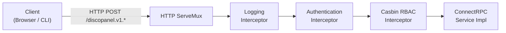

#### Interceptor Pipeline
- **Logging Interceptor (`loggingInterceptor`)**: Records incoming RPC calls with client IP and procedure name, automatically filtering high-frequency polling endpoints (`GetServer`, `GetServerLogs`, `GetUploadStatus`, `UploadChunk`, etc.).
- **Authentication & RBAC Interceptor (`authInterceptor`)**:
  - Checks if procedure is in `rbac.PublicProcedures` (e.g. `Login`, `GetAuthStatus`, `ValidateInvite`). If so, skips auth.
  - Extracts `Authorization: Bearer <token>` header, validating against JWT sessions or SHA-256 hashed API tokens (`dp_...`).
  - Injects authenticated user into `context.Context`.
  - Checks `rbac.AuthenticatedOnlyProcedures` (e.g. `GetCurrentUser`, `ChangePassword`, `GetMinecraftVersions`).
  - Resolves object-level scoping via `extractObjectID()` using Protobuf reflection (e.g. extracting `server_id` or `id` from request).
  - Enforces Casbin policy: `enforcer.Enforce(user.Roles, perm.Resource, perm.Action, objectID)`. Returns `CodePermissionDenied` (403) if disallowed.

#### Service Catalog

| Service | Protobuf Schema | Primary Implementation Responsibilities |
| :--- | :--- | :--- |
| **AuthService** | `auth.proto` | User login, registration, invite code verification, API token CRUD, OIDC URL generation, emergency recovery key reset. |
| **ServerService** | `server.proto` | Server CRUD, start/stop/restart/recreate, send console commands, fetch logs, MCLogs upload. |
| **ConfigService** | `config.proto` | Get/update/reset Minecraft server properties, JVM memory/flags, GraalVM flags, and global panel settings. |
| **FileService** | `file.proto` | File tree navigation, read/write/edit files, rename, delete, batch zip/tar compression, and archive extraction. |
| **MinecraftService** | `minecraft.proto` | Query available Minecraft versions, modloader catalogs (Fabric/Forge/NeoForge/Paper), Java compatibility, and Docker image tags. |
| **ModService** | `mod.proto` | List installed server mods, toggle `.disabled` extension, delete mods, import uploaded `.jar` files. |
| **ModpackService** | `modpack.proto` | Search Modrinth and CurseForge catalogs, resolve versions/dependencies, import uploaded modpacks, manage favorites. |
| **ModuleService** | `module.proto` | Manage sidecar templates and running module instances, start/stop/restart sidecars, view sidecar logs. |
| **ProxyService** | `proxy.proto` | Configure global proxy settings, manage TCP/UDP proxy listeners, and update server/module hostname routing rules. |
| **RoleService** | `role.proto` | Role CRUD, Casbin permission matrix management, resource and scope object discovery. |
| **TaskService** | `task.proto` | Scheduled tasks CRUD, manual execution triggers, task execution logs, and live execution cancellation. |
| **UserService** | `user.proto` | User administration, assign/revoke roles, update passwords, toggle account activation status. |
| **SupportService** | `support.proto` | Generate sanitized diagnostic bundles containing system info, Docker inspect output, and anonymized logs. |
| **UploadService** | `upload.proto` | Initialize chunked upload sessions, verify chunk integrity, and finalize uploaded files. |

---

### 4.3 Smart Minecraft & TCP/UDP Reverse Proxy (`internal/proxy/`)

DiscoPanel features a custom layer-4 / layer-7 reverse proxy that eliminates the need for dedicated public ports per Minecraft server.

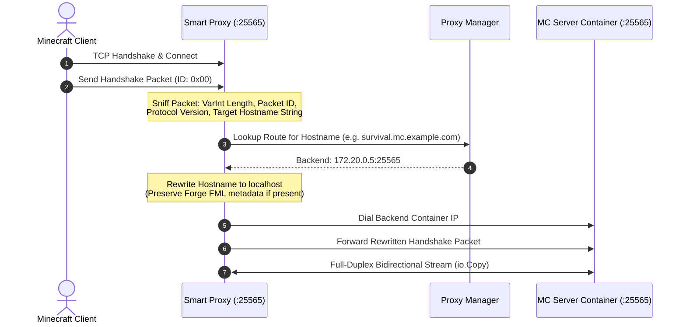

#### Key Technical Capabilities
- **Handshake Parsing (`ReadHandshakePacket`)**: Reads the initial unencrypted Minecraft handshake packet (`0x00`), deserializing the protocol version (VarInt), server address string, port (`uint16`), and next state (`1` for status ping, `2` for login).
- **Forge FML Protocol Preservation**: Forge clients append null-byte delimited metadata (`\x00FML\x00`, FML3 tokens) to the hostname. The proxy splits on null bytes, updates the host to `localhost` while preserving the exact FML token sequence, and re-encodes the packet.
- **Dynamic Container IP Resolution**: Maps hostnames directly to container IP addresses on the internal Docker network (`discopanel-network`), bypassing host port mapping overhead.
- **Multi-Protocol Support**: In addition to Minecraft TCP handshake routing, the proxy engine supports HTTP reverse proxying (for BlueMap and web sidecars), raw TCP streaming, and UDP proxying (for Geyser Bedrock).
- **PROXY Protocol v1/v2**: Supports emitting PROXY headers so backend servers can see real client IP addresses.

---

### 4.4 Docker Orchestration & Container Lifecycle (`internal/docker/`)

The Docker subsystem interfaces directly with the Docker Engine API via `github.com/docker/docker/client`:

- **Container Management**:
  - Pulls images (with optional registry credentials).
  - Creates containers with structured labels (`discopanel.managed=true`, `discopanel.server.id=...`, `discopanel.module.id=...`).
  - Configures memory limits, CPU shares, restart policies (`unless-stopped`), port bindings, and volume mounts.
  - Automatically attaches containers to the shared bridge network (`discopanel-network`).
- **Orphaned Container Cleanup (`CleanupOrphanedContainers`)**:
  - On startup, queries all containers labeled `discopanel.managed=true`.
  - Compares container IDs against the SQLite database.
  - Automatically stops and removes any orphaned containers whose metadata no longer exists in the store.
- **Real-Time Log Multiplexing (`LogStreamer`)**:
  - Attaches to Docker container stdout/stderr streams (`ContainerLogs`).
  - Demultiplexes Docker multiplex header frames (stdout `0x01`, stderr `0x02`).
  - Feeds lines into a circular in-memory ring buffer (up to 10,000 lines) and broadcasts them to active WebSocket subscribers.

---

### 4.5 Decoupled Background Metrics Collector (`internal/metrics/`)

To prevent blocking user requests and avoid slowing down server operations, the metrics collector runs **5 independent, decoupled background loops**:

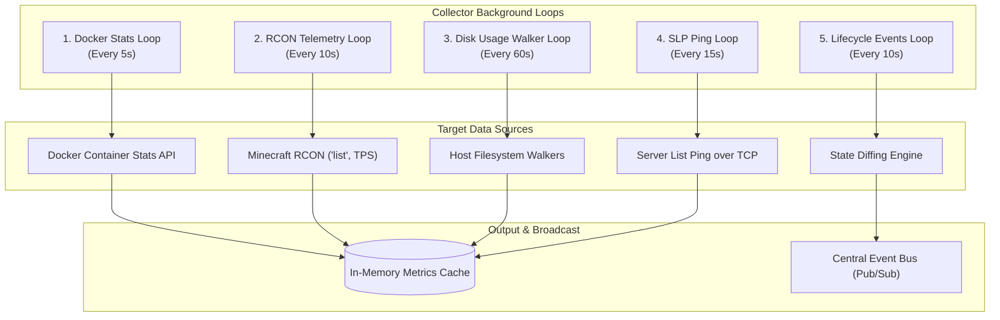

1. **Docker Stats Loop (`5s`)**: Collects CPU percentage and memory utilization for all active server and module containers.
2. **RCON Telemetry Loop (`10s`)**: Queries online player count via `list` command and parses TPS via configured TPS commands (e.g. `tps ?? forge tps`).
3. **Disk Usage Loop (`60s`)**: Executes fast cross-platform filesystem walkers to compute world directory size and total server storage footprint.
4. **SLP Loop (`15s`)**: Performs Server List Ping over TCP to container internal IPs, retrieving MOTD, favicon PNG (base64), protocol versions, latency (ms), and player samples without needing RCON.
5. **Lifecycle Events Loop (`10s`)**: Compares previous vs current health and player roster state. Emits `SERVER_HEALTHY`, `PLAYER_JOIN`, and `PLAYER_LEAVE` events directly onto the central Event Bus.

---

### 4.6 Module & Sidecar Templating System (`internal/alias/`, `internal/module/`)

DiscoPanel features an extensible sidecar system allowing supplementary containers (e.g., Geyser, BlueMap, MC-Backup, Prometheus Exporter) to attach to Minecraft servers.

#### Reflection-Based Dynamic Aliases (`internal/alias/alias.go`)
Templates use placeholder tags that are resolved dynamically at runtime using Go struct reflection:

```
{{server.id}}                           -> Server UUID
{{server.data_path}}                     -> Host filesystem path to server directory
{{server.proxy_hostname}}                -> Assigned subdomain
{{server.config.rconPort}}               -> RCON port from server configuration
{{server.config.rconPassword}}           -> RCON password from server configuration
{{host.uid}} / {{host.gid}}              -> Host process user/group IDs for permissions
{{host.hostname}}                        -> Hostname / IP address
{{config.storage.backup_dir}}            -> Global backup directory path
{{module.ports.<PortName>.host_port}}    -> Allocated host port for module
{{module.ports.<PortName>.container_port}}-> Module container port
{{modules.<sibling_name>.host}}          -> Inter-module container DNS name
```

#### Built-in Sidecar Templates
- **Geyser** (`nickheyer/discopanel-geyser:latest`): Translates Bedrock UDP packets (`19132`) to Java TCP packets (`25565`).
- **MC-Backup** (`itzg/mc-backup:latest`): RCON-coordinated automated backup sidecar.
- **RCON Web Admin** (`itzg/rcon:latest`): Web-based terminal and management UI.
- **Prometheus Exporter** (`itzg/mc-monitor:latest`): Scrapes status and exposes `/metrics` for Prometheus.
- **BlueMap** (`bluemap-minecraft/bluemap:latest`): 3D web map renderer mounting world directories read-only.
- **Status Panel** (`nickheyer/discopanel-status:latest`): External real-time status widget.

---

### 4.7 Automated Task Scheduler & Safe Backup Engine (`internal/scheduler/`)

The scheduler orchestrates recurring maintenance, command automation, and world backups.

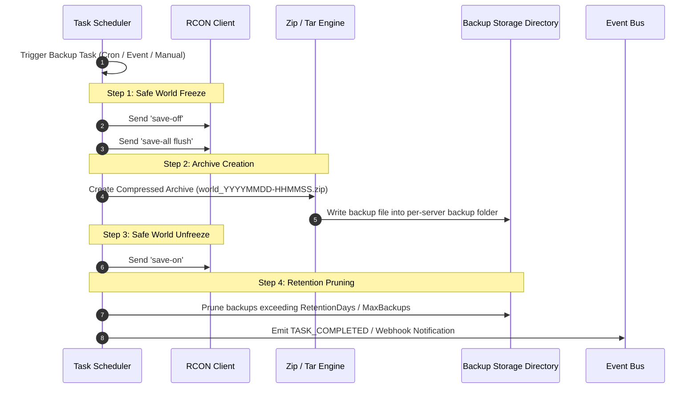

#### Trigger Types
- **Cron Expressions**: Standard 5-field cron parsing via `robfig/cron/v3` (e.g. `0 4 * * *` for 4 AM daily).
- **Interval Timers**: Fixed period execution (e.g. every `30m` or `2h`).
- **One-Shot Execution (`run_at`)**: Executed once at a specific timestamp.
- **Event Triggers**: Fired reactively when events occur on the Event Bus:
  - `TRIGGERED_EVENT_TYPE_SERVER_START`
  - `TRIGGERED_EVENT_TYPE_SERVER_STOP`
  - `TRIGGERED_EVENT_TYPE_SERVER_EMPTY` (when player count drops to 0)
  - `TRIGGERED_EVENT_TYPE_PLAYER_JOIN` / `PLAYER_LEAVE`
  - `TRIGGERED_EVENT_TYPE_SERVER_HEALTHY`

#### Action Handlers
- **RCON Command**: Sends one or more Minecraft commands with support for dynamic variable injection (`{{player}}`).
- **Backup**: Executes the 4-step safe backup workflow shown above.
- **Restart / Start / Stop**: Manages container state.
- **Webhook**: Dispatches HTTP POST notifications to external endpoints (Discord, Slack, custom webhook receivers).

---

### 4.8 Security, Authentication, OIDC & Casbin RBAC (`internal/auth/`, `internal/rbac/`)

#### Authentication Subsystem
- **Local Password Authentication**: Passwords hashed with `bcrypt` (cost 12).
- **JWT Sessions**: Signed JSON Web Tokens with configurable TTL (default 24h) and automatic periodic cleanup of expired sessions.
- **API Tokens**: Machine-to-machine tokens prefixed with `dp_` (e.g., `dp_3f8a...`), stored as SHA-256 hashes in SQLite.
- **Registration Invites**: Tokenized invite codes with optional max uses, expiration dates, and 4-digit PIN verification.
- **Emergency Recovery Key (`recovery.key`)**: Printed to stderr and saved to `./data/recovery.key` on boot if no admin is configured, allowing instant password resets.
- **OpenID Connect (OIDC) SSO**: Standard Authorization Code Flow with PKCE state validation. Supports role mapping from token claims (e.g., `groups` claim -> DiscoPanel RBAC roles).

#### Casbin RBAC Authorization
The RBAC engine enforces permissions using standard Casbin policies stored in SQLite:

```
p, role:admin, *, *, *
p, role:user, servers, read, *
p, role:user, servers, start, server-uuid-123
p, role:user, files, read, server-uuid-123
```

- **Resource Scoping**: Permissions can be global (`*`) or scoped to specific object IDs (e.g., `server_id`).
- **Default Roles**: Seeds `admin` (full wildcard permissions), `user` (read-only self-management), and `anonymous` (optional public read-only access).

---

### 4.9 Modpack & Mod Indexing Engine (`internal/indexers/`)

DiscoPanel abstracts modpack search, version resolution, and download management through a clean `ModpackIndexer` interface:

```go
type ModpackIndexer interface {
    SearchModpacks(ctx context.Context, query string, gameVersion string, modLoader string, offset, limit int) (*SearchResult, error)
    GetModpack(ctx context.Context, modpackID string) (*Modpack, error)
    GetModpackFiles(ctx context.Context, modpackID string) ([]ModpackFile, error)
    GetIndexerName() string
}
```

- **CurseForge Adapter (`internal/indexers/fuego/`)**: Interacts with the CurseForge ecosystem via the Fuego API gateway, mapping categories, release types (Release, Beta, Alpha), and server pack file IDs.
- **Modrinth Adapter (`internal/indexers/modrinth/`)**: Directly queries the Modrinth v2 REST API (`/v2/project`, `/v2/version`), resolving modpack versions, loaders (Fabric, Forge, Quilt, NeoForge), and project dependencies.
- **Client-to-Server Modpack Conversion**: Parses modpack manifests (`manifest.json` or `modrinth.index.json`), automatically filtering out client-only mods (sound physics, HUDs, shaders) during server provisioning.

---

### 4.10 Database Schema, SQLite Optimizations & Migrations (`internal/db/`)

#### SQLite Database Configuration
- **Driver**: `gorm.io/driver/sqlite` with WAL (Write-Ahead Logging) mode enabled.
- **Connection Pool**: `MaxConnections: 25`, `MaxIdleConns: 5`, `ConnMaxLifetime: 300s`.
- **Pre-Migration Safety Backup**: Before any migration executes, DiscoPanel issues `VACUUM INTO '<database_path>.pre-migrate.bak'` to create a consistent point-in-time snapshot.

#### Core Entity Relationships

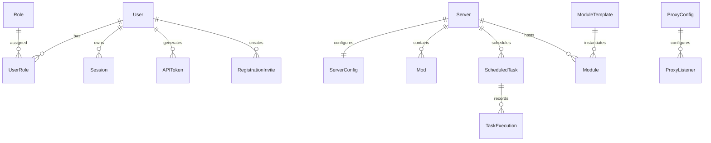

---

### 4.11 Frontend SPA Architecture (`web/discopanel/`)

The frontend is a modern Single Page Application built on **Svelte 5** and **SvelteKit 2**:

- **Svelte 5 Runes**: Utilizes modern runes (`$state`, `$derived`, `$props`, `$effect`) for fine-grained reactivity and minimal re-render overhead.
- **Embedded Static Adapter**: Configured with `@sveltejs/adapter-static` (`fallback: 'index.html'`) to compile into a static bundle served directly from Go memory via `embed.FS`.
- **Styling**: **TailwindCSS v4** with `@tailwindcss/vite` and CSS theme variables.
- **UI Primitives**: Headless accessible components from **Bits UI** (`bits-ui`), drawer components from `vaul-svelte`, resizable panes from `paneforge`, charts from `layerchart`, and toasts from `svelte-sonner`.
- **Code & Configuration Editor**: In-browser editing powered by **Monaco Editor** (`monaco-editor`) with syntax highlighting for JSON, YAML, properties, and TOML.
- **ConnectRPC Client (`rpcClient`)**: Singleton Connect-Web client that injects authorization headers, automatically tracks active RPC loading states, and handles automatic logout on `Unauthenticated` errors.

---

### 4.12 Real-Time WebSocket Multiplexer (`internal/ws/`)

Located at `/ws`, the WebSocket hub provides a multiplexed binary protocol for real-time bidirectional streaming:

- **Protobuf-Framed Protocol (`proto/discopanel/v1/websocket.proto`)**: Messages are serialized as Protobuf binary payloads (`WebSocketClientMessage` and `WebSocketServerMessage`).
- **Message Types**:
  - `AUTH`: Authenticates connection via JWT or API token.
  - `SUBSCRIBE` / `UNSUBSCRIBE`: Subscribes to live stdout/stderr logs for a specific `serverId` with optional tail buffer.
  - `LOG` / `LOGS`: Server-to-client streaming of single or batched log lines.
  - `COMMAND`: Sends interactive terminal commands to the running Minecraft server.
  - `PING` / `PONG`: Heartbeat keepalive every 30 seconds.
- **Frontend Batching**: The frontend WebSocket store buffers incoming log entries and flushes them in 100ms intervals to optimize DOM rendering performance.

---

## 5. End-to-End Data Flow Walkthroughs

### 5.1 User Web UI Action to Container Execution

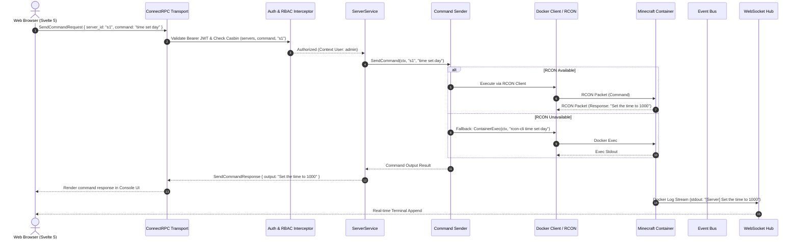

---

### 5.2 Minecraft Player Inbound Handshake & Dynamic Routing

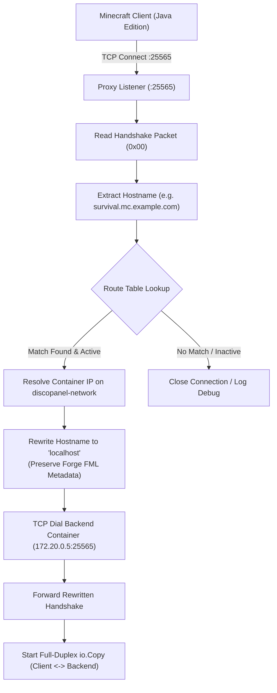

---

### 5.3 Scheduled RCON-Coordinated Safe Backup Execution

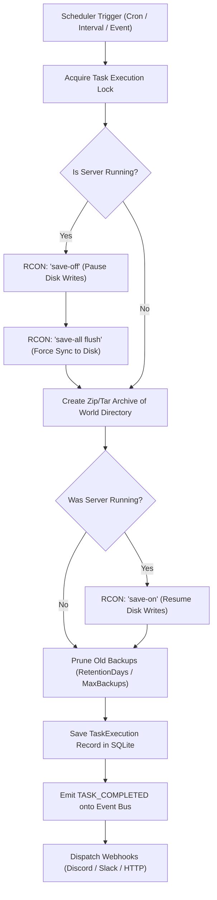

---

### 5.4 Chunked File Upload & Processing

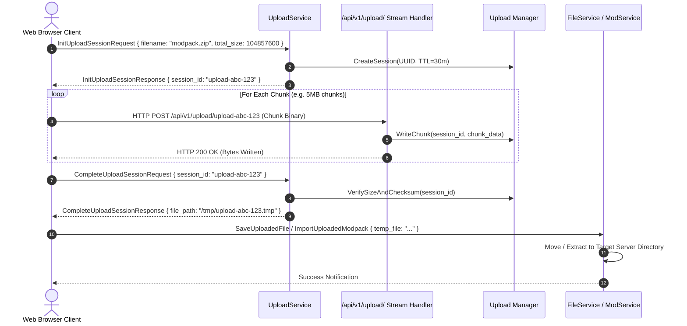

---

## 6. Build, Compilation & Embedding Pipeline

DiscoPanel uses a streamlined, reproducible build pipeline orchestrating Buf (Protobuf), Vite/SvelteKit (Frontend), and Go compiler (Binary):

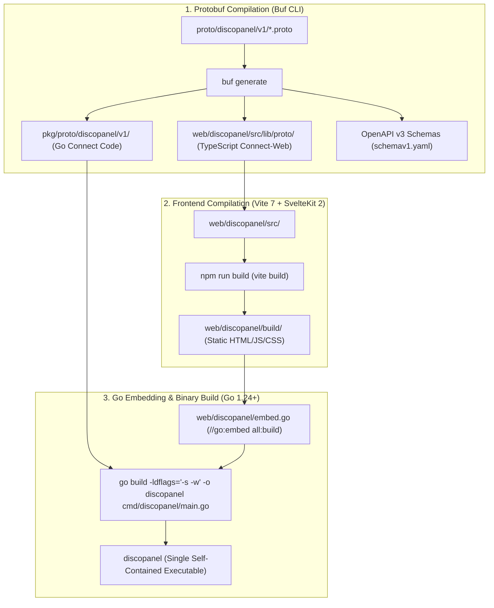

### Key Make Targets
- `make dev`: Concurrently runs SvelteKit live dev server (`localhost:5173`) and Go backend daemon (`localhost:8080`).
- `make gen`: Recompiles all Protobuf definitions and TypeScript clients via Dockerized `bufbuild/buf`.
- `make build`: Executes full production pipeline, building static web assets and compiling the standalone Go binary.
- `make docker`: Builds the multi-stage production Docker container (`docker/Dockerfile.discopanel`).
- `make modules`: Builds and tags all sidecar container images (`geyser`, `status`).

---

## 7. Configuration & Environment Variables Matrix

All configuration options can be set via `config.yaml` or overridden via environment variables prefixed with `DISCOPANEL_` (mapping nested YAML dots to underscores):

| YAML Key | Environment Variable | Default Value | Description |
| :--- | :--- | :--- | :--- |
| `server.port` | `DISCOPANEL_SERVER_PORT` | `8080` | Web UI and ConnectRPC HTTP listening port |
| `server.host` | `DISCOPANEL_SERVER_HOST` | `0.0.0.0` | Bind address for main server |
| `server.read_timeout` | `DISCOPANEL_SERVER_READ_TIMEOUT` | `30` | HTTP read timeout in seconds |
| `server.write_timeout` | `DISCOPANEL_SERVER_WRITE_TIMEOUT` | `30` | HTTP write timeout in seconds |
| `database.path` | `DISCOPANEL_DATABASE_PATH` | `./data/discopanel.db` | SQLite database file location |
| `database.auto_migrate` | `DISCOPANEL_DATABASE_AUTO_MIGRATE`| `true` | Run GORM schema auto-migrations on boot |
| `database.max_connections` | `DISCOPANEL_DATABASE_MAX_CONNECTIONS`| `25` | Max open database connections |
| `docker.host` | `DISCOPANEL_DOCKER_HOST` | `unix:///var/run/docker.sock` | Docker daemon socket URI |
| `docker.network_name` | `DISCOPANEL_DOCKER_NETWORK_NAME` | `discopanel-network` | Docker bridge network for managed containers |
| `docker.sync_interval` | `DISCOPANEL_DOCKER_SYNC_INTERVAL` | `5` | Seconds between container state synchronization |
| `storage.data_dir` | `DISCOPANEL_DATA_DIR` | `./data` | Local directory for server world and configuration storage |
| `-` | `DISCOPANEL_HOST_DATA_PATH` | `""` | Host filesystem path mapped to container data directory |
| `storage.backup_dir` | `DISCOPANEL_STORAGE_BACKUP_DIR` | `./backups` | Target directory for compressed server backups |
| `storage.temp_dir` | `DISCOPANEL_STORAGE_TEMP_DIR` | `./tmp` | Working directory for chunked uploads and downloads |
| `proxy.enabled` | `DISCOPANEL_PROXY_ENABLED` | `false` | Enable/disable the Minecraft reverse proxy |
| `proxy.base_url` | `DISCOPANEL_PROXY_BASE_URL` | `""` | Base wildcard domain for server routing (e.g. `mc.example.com`) |
| `proxy.listen_port` | `DISCOPANEL_PROXY_LISTEN_PORT` | `25565` | Inbound Minecraft proxy listening port |
| `proxy.listen_ports` | `DISCOPANEL_PROXY_LISTEN_PORTS` | `[25565]` | Array of listening ports for proxy listeners |
| `auth.session_timeout` | `DISCOPANEL_AUTH_SESSION_TIMEOUT` | `86400` | JWT session validity duration in seconds (24h) |
| `auth.anonymous_access` | `DISCOPANEL_AUTH_ANONYMOUS_ACCESS`| `false` | Allow public read-only access without login |
| `auth.local.enabled` | `DISCOPANEL_AUTH_LOCAL_ENABLED` | `true` | Enable username/password authentication |
| `auth.local.allow_registration`| `DISCOPANEL_AUTH_LOCAL_ALLOW_REGISTRATION` | `false` | Allow public sign-up without registration invites |
| `auth.oidc.enabled` | `DISCOPANEL_AUTH_OIDC_ENABLED` | `false` | Enable OpenID Connect SSO integration |
| `auth.oidc.issuer_uri` | `DISCOPANEL_AUTH_OIDC_ISSUER_URI` | `""` | OIDC Provider Issuer URL |
| `auth.oidc.client_id` | `DISCOPANEL_AUTH_OIDC_CLIENT_ID` | `""` | OIDC Client ID |
| `auth.oidc.client_secret` | `DISCOPANEL_AUTH_OIDC_CLIENT_SECRET` | `""` | OIDC Client Secret |
| `auth.oidc.role_claim` | `DISCOPANEL_AUTH_OIDC_ROLE_CLAIM` | `groups` | Token claim containing user groups for RBAC role mapping |
| `upload.max_upload_size` | `DISCOPANEL_UPLOAD_MAX_UPLOAD_SIZE` | `10737418240` | Maximum upload size in bytes (default 10 GB) |
| `upload.session_ttl` | `DISCOPANEL_UPLOAD_SESSION_TTL` | `30` | Upload session timeout in minutes |
| `logging.enabled` | `DISCOPANEL_LOGGING_ENABLED` | `true` | Enable structured application file logging |
| `logging.file_path` | `DISCOPANEL_LOGGING_FILE_PATH` | `./data/discopanel.log` | Application log file destination |
| `logging.max_size` | `DISCOPANEL_LOGGING_MAX_SIZE` | `10` | Max log size in megabytes before rotation |
| `logging.max_backups` | `DISCOPANEL_LOGGING_MAX_BACKUPS` | `5` | Maximum number of retained rotated log files |
| `logging.max_age` | `DISCOPANEL_LOGGING_MAX_AGE` | `30` | Retained log file age in days |
| `logging.compress` | `DISCOPANEL_LOGGING_COMPRESS` | `true` | Compress rotated log archives with gzip |
