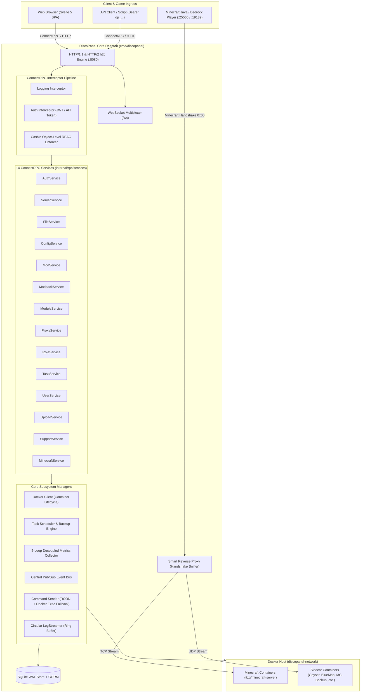

# DiscoPanel: Agent Context & Engineering Blueprint

> **Canonical System Knowledge Base & Navigation Compass for AI Agents and Developers**  
> Repository: `github.com/nickheyer/discopanel` | Target: Go 1.24+ / Svelte 5 / ConnectRPC v1 / SQLite WAL / Docker Engine

---

## 1. Executive System Overview

DiscoPanel is a container-native Minecraft server management platform, smart reverse proxy, module sidecar orchestrator, and modpack manager packaged as a **single, zero-dependency Go binary** embedding a compiled **Svelte 5 Single Page Application (SPA)**.



### Core Invariants & Pillars
1. **Unified Single-Binary Runtime**: Svelte 5 frontend is compiled to `web/discopanel/build/` and embedded directly into the Go daemon using `embed.FS` (`web/discopanel/embed.go`).
2. **Strict Protocol-First Schema**: All RPC endpoints, models, and WebSocket messages are strictly authored in Protobuf v3 (`proto/discopanel/v1/*.proto`) and compiled via Buf into Go Connect handlers and TypeScript Connect-Web clients.
3. **Smart SNI/Handshake Reverse Proxy**: L4/L7 proxy inspects Minecraft unencrypted handshake packets (`0x00`) to multiplex unlimited Minecraft server containers across a single public port (e.g. `25565`) using subdomains (`survival.mc.example.com`).
4. **Decoupled Background Telemetry**: 5 concurrent, isolated worker loops collect metrics (Docker stats, RCON queries, disk walkers, SLP ping, lifecycle diffs) without blocking RPC handlers.
5. **Fine-Grained Casbin RBAC**: Enforces `(subject, resource, action, object_id)` tuples stored in SQLite, enabling object-level scoping (e.g. user permitted to execute commands only on Server `X`).

---

## 2. Master Subsystem Index & File Map

### Entrypoints (`cmd/`)
| Relative Path | Primary Purpose | Key Types / Entry Functions |
| :--- | :--- | :--- |
| `cmd/discopanel/main.go` | Main daemon bootstrap, service wiring, auto-start servers, graceful shutdown | `main()`, `initSubsystems()` |
| `cmd/geyser/main.go` | Standalone Geyser Bedrock bridge container wrapper with privilege dropping | `main()`, `dropPrivileges()`, `generateConfig()` |
| `cmd/status/main.go` | Standalone status dashboard module polling ConnectRPC API with HTML rendering | `main()`, `pollStats()`, `handleStatus()` |

### ConnectRPC Transport & Handlers (`internal/rpc/`)
| Relative Path | Primary Purpose | Key Types / Handlers |
| :--- | :--- | :--- |
| `internal/rpc/server.go` | HTTP/2 h2c server, interceptor pipeline, gRPC reflection, service handler registration | `Server`, `NewServer()`, `setupHandler()`, `registerServices()` |
| `internal/rpc/handlers/upload.go` | HTTP chunked file upload receiver stream handler (`/api/v1/upload/`) | `UploadStreamHandler`, `ServeHTTP()` |
| `internal/rpc/handlers/download.go` | HTTP streaming file/archive download handler (`/api/v1/download/`) | `DownloadStreamHandler`, `ServeHTTP()` |
| `internal/rpc/handlers/openapi.go` | Dynamic OpenAPI v3 YAML specification provider (`/api/v1/openapi.yaml`) | `OpenAPIHandler`, `ServeHTTP()` |
| `internal/rpc/services/auth.go` | User login, JWT sessions, API tokens, invite validation, OIDC redirect | `AuthService`, `Login()`, `CreateAPIToken()` |
| `internal/rpc/services/server.go` | Server CRUD, start/stop/restart/recreate, terminal commands, logs, MCLogs upload | `ServerService`, `CreateServer()`, `SendCommand()` |
| `internal/rpc/services/config.go` | Server Minecraft properties, JVM/GraalVM flags, global settings discovery | `ConfigService`, `GetServerConfig()`, `UpdateServerConfig()` |
| `internal/rpc/services/file.go` | File tree navigation, editor read/write, rename, delete, batch zip/tar extract | `FileService`, `ListFiles()`, `GetFileContent()`, `ExtractArchive()` |
| `internal/rpc/services/minecraft.go` | Minecraft version catalog, mod loaders (Forge/Fabric/NeoForge/Paper), Java matrix | `MinecraftService`, `GetMinecraftVersions()`, `GetModLoaders()` |
| `internal/rpc/services/mod.go` | Server mod installation, toggle `.disabled` extension, delete mods | `ModService`, `ListMods()`, `ToggleMod()`, `InstallMod()` |
| `internal/rpc/services/modpack.go` | CurseForge & Modrinth catalog search, dependency resolution, version install | `ModpackService`, `SearchModpacks()`, `InstallModpack()` |
| `internal/rpc/services/module.go` | Sidecar templates and active module instances CRUD, start/stop, module logs | `ModuleService`, `ListModuleTemplates()`, `CreateModule()` |
| `internal/rpc/services/proxy.go` | Proxy configuration, TCP/UDP listeners management, subdomain routing rules | `ProxyService`, `GetProxyConfig()`, `UpdateRoutingRules()` |
| `internal/rpc/services/role.go` | Casbin role management, permission assignment matrix, scope discovery | `RoleService`, `ListRoles()`, `UpdateRolePermissions()` |
| `internal/rpc/services/task.go` | Scheduled automation CRUD (cron/interval/event), manual execution triggers | `TaskService`, `ListTasks()`, `RunTask()`, `CancelTask()` |
| `internal/rpc/services/user.go` | User administration, account activation, password resets | `UserService`, `ListUsers()`, `UpdateUser()` |
| `internal/rpc/services/support.go` | Sanitized diagnostic bundle generation (system info, Docker inspect, logs) | `SupportService`, `GenerateDiagnosticBundle()` |
| `internal/rpc/services/upload.go` | Chunked upload session initialization, verification, and file assembly | `UploadService`, `InitUploadSession()`, `CompleteUploadSession()` |

### Core Engines & Business Logic (`internal/`)
| Relative Path | Primary Purpose | Key Types / Interfaces |
| :--- | :--- | :--- |
| `internal/db/store.go` | GORM SQLite store, WAL mode configuration, transaction helpers | `Store`, `NewSQLiteStore()`, `DB()` |
| `internal/db/models.go` | Database entity models (Server, ServerConfig, User, Role, Module, Task, etc.) | `Server`, `ServerConfig`, `User`, `Role`, `Module` |
| `internal/db/migrations.go` | Pre-migration `VACUUM INTO` safety backups, gormigrate steps, system seeders | `RunMigrations()`, `SeedDefaultData()` |
| `internal/docker/client.go` | Docker Engine API wrapper, container CRUD, inspect, network attachments | `Client`, `NewClient()`, `CreateContainer()`, `StartContainer()` |
| `internal/docker/cleanup.go` | Startup scanner removing orphaned containers labeled `discopanel.managed=true` | `CleanupOrphanedContainers()` |
| `internal/docker/module.go` | Docker sidecar container creation, port bindings, volume mappings | `CreateModuleContainer()`, `StartModuleContainer()` |
| `internal/proxy/manager.go` | Multi-listener reverse proxy engine, routing table, route updates | `Manager`, `NewManager()`, `AddRoute()`, `RemoveRoute()` |
| `internal/proxy/minecraft.go` | Minecraft handshake sniffer (`0x00`), hostname extraction, Forge token handling | `HandleMinecraftConnection()`, `ReadHandshakePacket()` |
| `internal/proxy/protocol.go` | Low-level Minecraft packet encoding/decoding, VarInt reader/writer | `ReadVarInt()`, `WriteVarInt()`, `HandshakePacket` |
| `internal/proxy/tcp.go` / `udp.go` | Raw TCP stream proxying and UDP Bedrock proxying | `ProxyTCP()`, `ProxyUDP()` |
| `internal/proxy/http.go` | Reverse HTTP proxy for web-based sidecars (BlueMap, RCON Web Admin) | `NewHTTPReverseProxy()` |
| `internal/metrics/collector.go` | 5 concurrent background telemetry loops (Docker, RCON, Disk, SLP, Diff) | `Collector`, `NewCollector()`, `Start()`, `GetMetrics()` |
| `internal/scheduler/scheduler.go` | Cron (`robfig/cron/v3`), Interval, and Event-triggered task execution engine | `Scheduler`, `NewScheduler()`, `RunTaskNow()` |
| `internal/scheduler/backup.go` | RCON-coordinated safe backup runner (`save-off` -> Tar/Zip -> `save-on` -> Prune) | `CreateBackup()`, `PruneOldBackups()` |
| `internal/auth/manager.go` | Password hashing (bcrypt), JWT generation/validation, emergency recovery key | `Manager`, `NewManager()`, `GenerateToken()`, `ValidateToken()` |
| `internal/auth/oidc.go` | OIDC Authorization Code flow with PKCE, token verification, claim mapping | `OIDCHandler`, `HandleLogin()`, `HandleCallback()` |
| `internal/rbac/rbac.go` | Casbin enforcer initialization, policy synchronization, rule evaluation | `Enforcer`, `NewEnforcer()`, `Enforce()` |
| `internal/rbac/mapping.go` | Procedure-to-Permission mapping table and Protobuf ObjectID reflection | `GetProcedurePermission()`, `extractObjectID()` |
| `internal/module/manager.go` | Sidecar lifecycle orchestrator, template engine, dependency startup order | `Manager`, `NewManager()`, `CreateModule()`, `StartModule()` |
| `internal/module/builtin_templates.go` | Built-in sidecar blueprints (Geyser, BlueMap, MC-Backup, RCON Web, etc.) | `InitBuiltinTemplates()`, `BuiltinTemplates` |
| `internal/alias/alias.go` | Dynamic reflection substitution engine (`{{server.*}}`, `{{host.*}}`, `{{module.*}}`) | `Resolve()`, `ResolveString()`, `Context` |
| `internal/events/bus.go` | Central in-memory pub/sub Event Bus for server and task lifecycle events | `Bus`, `NewBus()`, `Publish()`, `Subscribe()` |
| `internal/command/sender.go` | High-level server command dispatcher (Minecraft RCON + Docker Exec fallback) | `Sender`, `NewSender()`, `SendCommand()` |
| `internal/rcon/rcon.go` | Thread-safe pooled Minecraft RCON client connection wrapper | `Client`, `NewClient()`, `ExecuteCommand()` |
| `internal/minecraft/slp.go` | Server List Ping (SLP) TCP client (MOTD, favicon PNG, latency, player count) | `PingServer()`, `SLPResponse` |
| `internal/minecraft/modloader.go`| Mod loader definitions, compatibility checks, and container image mapping | `GetSupportedLoaders()`, `GetLoaderInfo()` |
| `internal/indexers/indexer.go` | Modpack indexing abstraction interface and provider registry | `ModpackIndexer`, `GetIndexer()` |
| `internal/indexers/modrinth/` | Modrinth v2 REST API client adapter | `ModrinthAdapter`, `SearchModpacks()`, `GetModpack()` |
| `internal/indexers/fuego/` | CurseForge API adapter (via Fuego gateway) | `FuegoAdapter`, `SearchModpacks()`, `GetModpack()` |
| `internal/ws/hub.go` | Multiplexed WebSocket Hub for streaming logs, terminal I/O, and ping/pong | `Hub`, `NewHub()`, `Run()`, `HandleConnection()` |
| `internal/config/config.go` | Viper configuration management, defaults, and `DISCOPANEL_*` env binding | `Config`, `LoadConfig()` |

### Shared Packages (`pkg/`)
| Relative Path | Primary Purpose |
| :--- | :--- |
| `pkg/logger/logger.go` | Structured lumberjack file logging and console output |
| `pkg/logger/log_streamer.go` | Circular ring buffer (10,000 lines) and container log multiplexer |
| `pkg/upload/upload.go` | Chunked upload receiver, session TTL cleaner, and file assembler |
| `pkg/download/download.go` | Streaming multi-file zip archive builder with session tracking |
| `pkg/files/files.go` | Safe file manipulation, ZipSlip-protected extraction, directory size walkers |
| `pkg/files/disk_unix.go` / `disk_windows.go` | Cross-platform host filesystem disk usage calculation |
| `pkg/strmatch/strmatch.go` | Fast glob and fuzzy string pattern matchers |
| `pkg/utils/strings.go` | String utilities, random tokens, byte unit formatting |

### Schemas & Generated Code (`proto/`, `pkg/proto/`, `web/.../proto/`)
| Path | Description |
| :--- | :--- |
| `proto/discopanel/v1/*.proto` | 17 Protobuf v3 service & message schema definitions |
| `pkg/proto/discopanel/v1/` | Generated Go Protobuf structs (`*.pb.go`) |
| `pkg/proto/discopanel/v1/discopanelv1connect/` | Generated Go ConnectRPC handler & client interfaces (`*connect.go`) |
| `web/discopanel/src/lib/proto/discopanel/v1/` | Generated TypeScript Protobuf & Connect-Web client definitions |
| `web/discopanel/static/schemav1.yaml` | Generated OpenAPI v3 specification |

### Frontend Application (`web/discopanel/src/`)
| Relative Path | Primary Purpose |
| :--- | :--- |
| `src/routes/+layout.svelte` | Root app shell, navigation sidebar, global loading indicator, toast viewport |
| `src/routes/+page.svelte` | Main dashboard (resource gauges, active server cards, quick actions) |
| `src/routes/servers/+page.svelte` | Server fleet list, status filters, bulk start/stop controls |
| `src/routes/servers/new/+page.svelte` | Multi-step server creation wizard (loader, version, modpack, memory, ports) |
| `src/routes/servers/[id]/+page.svelte`| Tabbed server management workspace (Console, Config, Files, Mods, Modules, Tasks, Routing, Settings) |
| `src/routes/modpacks/+page.svelte` | CurseForge & Modrinth modpack store and one-click deployment |
| `src/routes/modules/+page.svelte` | Global sidecar template catalog and active module instances |
| `src/routes/settings/+page.svelte` | Global system administration (Auth & Invites, RBAC matrix, Proxy, Support bundle) |
| `src/routes/profile/+page.svelte` | User profile, active sessions, API token management (`dp_...`) |
| `src/routes/login/+page.svelte` | Login UI (Local auth, OIDC buttons, invite registration, first-run admin setup) |
| `src/lib/api/rpc-client.ts` | Connect-Web RPC client singleton with auth interceptor & toast error handling |
| `src/lib/stores/auth.ts` | Reactive authentication store (JWT, user profile, login/logout, tokens) |
| `src/lib/stores/ws.ts` | Multiplexed WebSocket store for log subscriptions and console terminal commands |
| `src/lib/components/` | Svelte 5 UI components (Monaco editor, file tree, port editor, docker overrides, etc.) |

---

## 3. Architectural Rules & Coding Standards

### 3.1 Backend Engineering Standards (Go 1.24+)

1. **ConnectRPC Service Implementation Pattern**:
   - Services MUST implement their respective `discopanelv1connect.<Service>Handler` interface.
   - Handlers receive `context.Context` and `*connect.Request[ReqType]` and return `(*connect.Response[RespType], error)`.
   - Wrap return values using `connect.NewResponse(&v1.ResponseType{ ... })`.
   - Error handling MUST return standard ConnectRPC errors with exact semantic codes:
     ```go
     // Not Found
     return nil, connect.NewError(connect.CodeNotFound, fmt.Errorf("server %s not found", req.Msg.Id))
     // Permission Denied
     return nil, connect.NewError(connect.CodePermissionDenied, fmt.Errorf("insufficient permissions"))
     // Invalid Argument / Validation
     return nil, connect.NewError(connect.CodeInvalidArgument, fmt.Errorf("invalid memory limit: %d", req.Msg.Memory))
     // Internal Failure
     return nil, connect.NewError(connect.CodeInternal, fmt.Errorf("failed to start container: %w", err))
     ```

2. **GORM & SQLite Concurrency**:
   - SQLite operates in WAL mode (`PRAGMA journal_mode=WAL;`).
   - SQLite supports multiple concurrent readers but **strictly a single writer**. Never launch unbounded concurrent DB write goroutines without synchronization.
   - Always pass `ctx context.Context` to GORM queries: `s.store.DB().WithContext(ctx)...`.
   - Run pre-migration snapshot before schema modifications: `VACUUM INTO '<database_path>.pre-migrate.bak'`.

3. **Casbin RBAC & Request Scoping**:
   - Every procedure requiring authorization MUST be registered in `internal/rbac/mapping.go`.
   - If a procedure operates on a specific resource instance (e.g. Server, Module), provide the Protobuf field name in `ObjectIDField` (e.g. `"id"` or `"server_id"`).
   - Retrieve authenticated user from context: `user, ok := auth.UserFromContext(ctx)`.

4. **Goroutine Safety & Context Cancellation**:
   - Decoupled background loops MUST accept `context.Context` or `<-chan struct{}` and handle `SIGINT`/`SIGTERM` graceful shutdown cleanly within 30 seconds.
   - Thread-safe data stores (metrics cache, WebSocket subscribers) MUST use `sync.RWMutex`.

---

### 3.2 Frontend Engineering Standards (Svelte 5 & Vite 7)

1. **Strict Svelte 5 Runes**:
   - **State**: Use `let count = $state(0)` or `let servers: Server[] = $state([])`.
   - **Derived State**: Use `let runningCount = $derived(servers.filter(s => s.status === ServerStatus.RUNNING).length)`.
   - **Component Props**: Use `let { server, disabled = false, onchange }: Props = $props()`.
   - **Two-Way Binding**: Use `let { value = $bindable() }: Props = $props()`.
   - **Side Effects**: Use `$effect(() => { ... })` for reactive subscriptions / DOM side-effects.
   - **PROHIBITED**: NEVER use legacy Svelte 3/4 syntax (`export let`, `$: reactive declarations`, `beforeUpdate`, `afterUpdate`).

2. **Protobuf v3 Message Construction**:
   - Always instantiate Protobuf objects using `create()` from `@bufbuild/protobuf`:
     ```typescript
     import { create } from '@bufbuild/protobuf';
     import { ServerSchema, ServerStatus } from '$lib/proto/discopanel/v1/common_pb';

     const server = create(ServerSchema, {
       id: 'srv-1',
       name: 'Survival Server',
       status: ServerStatus.STOPPED
     });
     ```

3. **ConnectRPC Web Client Usage**:
   - Always use the typed singleton `rpcClient` from `$lib/api/rpc-client`:
     ```typescript
     import { rpcClient, silentCallOptions } from '$lib/api/rpc-client';

     // Standard request (shows global loading spinner and toasts errors)
     const res = await rpcClient.server.getServer({ id: serverId });

     // High-frequency polling request (silent, no loading spinner, no error toast)
     const stats = await rpcClient.server.getServer({ id: serverId }, silentCallOptions);
     ```

4. **Styling & UI Components**:
   - Use Tailwind CSS v4 utility classes and CSS variables defined in `src/app.css`.
   - Rely on `bits-ui` primitives and `@lucide/svelte` for icons.

---

### 3.3 Protobuf & Schema Workflow (Buf CLI)

1. **Schema Location**: All Protobuf definitions reside in `proto/discopanel/v1/*.proto`.
2. **Naming Conventions**:
   - RPC services end in `Service` (e.g. `ServerService`).
   - Request and Response types match procedure names (e.g. `CreateServerRequest`, `CreateServerResponse`).
   - Enums use `SCREAMING_SNAKE_CASE` with a type prefix (e.g. `enum TaskType { TASK_TYPE_UNSPECIFIED = 0; TASK_TYPE_COMMAND = 1; }`).
3. **NEVER EDIT GENERATED CODE DIRECTLY**:
   - `pkg/proto/**` (Go generated code)
   - `web/discopanel/src/lib/proto/**` (TypeScript generated code)
   - `web/discopanel/static/schemav1.yaml` (OpenAPI specification)

---

## 4. Key Development & Build Commands

All primary development tasks are orchestrated via `make`:

```bash
# === DEVELOPMENT ===
make dev              # Starts frontend dev server (:5173) and Go backend daemon (:8080) concurrently
make run              # Runs backend + frontend without clearing development database
make dev-docs         # Starts Astro + Starlight documentation dev server

# === CODE GENERATION (Protobuf / Buf) ===
make gen              # Cleans and regenerates all Go, TypeScript, and OpenAPI code from .proto files
make proto-lint       # Lints proto definitions for style and correctness
make proto-format     # Formats all .proto files according to Buf standards
make proto-breaking   # Checks proto changes for breaking API changes against git main branch

# === BUILDING & PRODUCTION ===
make build-frontend   # Builds static SvelteKit bundle to web/discopanel/build/
make build            # Compiles frontend and produces standalone Go binary: build/discopanel
make prod             # Production build and run

# === TESTING & QUALITY ===
make test             # Runs all Go unit and integration tests (go test ./...)
make check            # Runs SvelteKit type checking (svelte-check)
make lint             # Lints frontend TypeScript and Svelte components
make fmt              # Formats Go code (go fmt) and frontend code (prettier)

# === DOCKER & CONTAINER MODULES ===
make dev-docker       # Builds and runs DiscoPanel locally in Docker Compose with fresh state
make image            # Builds and pushes the main DiscoPanel container image (:dev tag)
make modules          # Builds and pushes all module container images (geyser, status)
make module-geyser    # Builds and pushes nickheyer/discopanel-geyser:latest
make module-status    # Builds and pushes nickheyer/discopanel-status:latest

# === AUTHENTICATION & OIDC TESTING ===
make dev-auth-keycloak  # Launches Keycloak OIDC compose environment and seeds test realm
make dev-auth-authelia  # Launches Authelia OIDC compose environment
make dev-auth-discord   # Launches Discord OAuth2 proxy compose
make dev-auth-google    # Launches Google OAuth2 proxy compose

# === CLEANUP & MAINTENANCE ===
make clean            # Clears ./data, /tmp/discopanel, and compiled binaries
make kill-dev         # Kills any orphaned Vite, Go run, or discopanel processes
make deps             # Updates and downloads Go modules, npm packages, and buf dependencies
```

---

## 5. Step-by-Step Extension Recipes for Agents

### Recipe 1: Adding a New ConnectRPC Service or Endpoint

1. **Define Schema (`proto/discopanel/v1/<service>.proto`)**:
   ```protobuf
   syntax = "proto3";
   package discopanel.v1;

   service NetworkService {
     rpc PingHost(PingHostRequest) returns (PingHostResponse);
   }

   message PingHostRequest {
     string host = 1;
   }

   message PingHostResponse {
     int64 latency_ms = 1;
     bool reachable = 2;
   }
   ```
2. **Regenerate Code**: Run `make gen` (compiles Go handlers to `pkg/proto/` and TS to `web/.../proto/`).
3. **Implement Service Handler (`internal/rpc/services/network.go`)**:
   ```go
   package services

   import (
       "context"
       "fmt"
       "connectrpc.com/connect"
       "github.com/nickheyer/discopanel/pkg/logger"
       v1 "github.com/nickheyer/discopanel/pkg/proto/discopanel/v1"
       "github.com/nickheyer/discopanel/pkg/proto/discopanel/v1/discopanelv1connect"
   )

   type NetworkService struct {
       log *logger.Logger
   }

   var _ discopanelv1connect.NetworkServiceHandler = (*NetworkService)(nil)

   func NewNetworkService(log *logger.Logger) *NetworkService {
       return &NetworkService{log: log}
   }

   func (s *NetworkService) PingHost(ctx context.Context, req *connect.Request[v1.PingHostRequest]) (*connect.Response[v1.PingHostResponse], error) {
       if req.Msg.Host == "" {
           return nil, connect.NewError(connect.CodeInvalidArgument, fmt.Errorf("host is required"))
       }
       // Service logic here...
       return connect.NewResponse(&v1.PingHostResponse{LatencyMs: 12, Reachable: true}), nil
   }
   ```
4. **Register in Server Pipeline (`internal/rpc/server.go`)**:
   - Add service instantiation in `s.registerServices()`.
   - Register route handler:
     ```go
     networkService := services.NewNetworkService(s.log)
     netPath, netHandler := discopanelv1connect.NewNetworkServiceHandler(networkService, opts...)
     mux.Handle(netPath, netHandler)
     ```
   - Add `discopanelv1connect.NetworkServiceName` to `grpcreflect.NewStaticReflector(...)`.
5. **Configure Casbin RBAC (`internal/rbac/mapping.go` & `resources.go`)**:
   ```go
   "/discopanel.v1.NetworkService/PingHost": {
       Resource: ResourceSystem,
       Action:   ActionRead,
   },
   ```
6. **Expose in Frontend Client (`web/discopanel/src/lib/api/rpc-client.ts`)**:
   - Import `NetworkService` from `$lib/proto/discopanel/v1/network_pb`.
   - Add `public readonly network: Client<typeof NetworkService>;` to `RpcClient` class.
7. **Call from Svelte Component**:
   ```typescript
   const res = await rpcClient.network.pingHost({ host: 'mc.hypixel.net' });
   ```

---

### Recipe 2: Adding a New Built-in Sidecar / Module Template

1. **Add Template Definition in `internal/module/builtin_templates.go`**:
   ```go
   {
       ID:             "builtin-metrics-exporter",
       Name:           "Prometheus Metrics Exporter",
       Description:    "Exposes Minecraft server metrics for Prometheus scraping on /metrics",
       Type:           storage.ModuleTemplateTypeBuiltin,
       DockerImage:    "itzg/mc-monitor:latest",
       Category:       "monitoring",
       SupportsProxy:  false,
       RequiresServer: true,
       Icon:           "activity",
       Ports: []*v1.ModulePort{
           {Name: "Metrics", ContainerPort: 8080, HostPort: 0, Protocol: "tcp", ProxyEnabled: false},
       },
       DefaultAccessUrls: []string{"http://{{host.hostname}}:{{module.ports.Metrics.host_port}}/metrics"},
       DefaultEnv: `{
           "SERVER_HOST": "discopanel-server-{{server.id}}",
           "SERVER_PORT": "25565"
       }`,
       DefaultVolumes:  `[]`,
       DefaultMemory:   128,
   }
   ```
2. **Template Interpolation Rules**:
   - `{{server.id}}`: UUID of the parent server.
   - `{{server.data_path}}`: Host directory path where server files reside.
   - `{{server.config.rconPassword}}`: RCON password from server configuration.
   - `{{host.uid}}` / `{{host.gid}}`: Host user/group IDs for permissions.
   - `{{module.ports.<PortName>.host_port}}`: Dynamically allocated host port.

---

### Recipe 3: Adding a New Frontend Route & Svelte 5 Component

1. **Create SvelteKit Route Directory (`web/discopanel/src/routes/analytics/+page.svelte`)**:
   ```svelte
   <script lang="ts">
       import { onMount } from 'svelte';
       import { rpcClient } from '$lib/api/rpc-client';
       import { Card, CardHeader, CardTitle, CardContent } from '$lib/components/ui/card';
       import { Button } from '$lib/components/ui/button';
       import type { Server } from '$lib/proto/discopanel/v1/common_pb';

       // Svelte 5 State Runes
       let servers: Server[] = $state([]);
       let isLoading = $state(true);

       // Svelte 5 Derived State
       let totalPlayers = $derived(
           servers.reduce((acc, s) => acc + (s.metrics?.onlinePlayers ?? 0), 0)
       );

       async function loadAnalytics() {
           isLoading = true;
           try {
               const res = await rpcClient.server.listServers({ fullStats: true });
               servers = res.servers;
           } finally {
               isLoading = false;
           }
       }

       onMount(() => {
           loadAnalytics();
       });
   </script>

   <div class="space-y-6 p-6">
       <div class="flex items-center justify-between">
           <h1 class="text-2xl font-bold tracking-tight">Fleet Analytics</h1>
           <Button onclick={loadAnalytics} disabled={isLoading}>Refresh</Button>
       </div>

       <div class="grid gap-4 md:grid-cols-2 lg:grid-cols-4">
           <Card>
               <CardHeader>
                   <CardTitle class="text-sm font-medium">Total Online Players</CardTitle>
               </CardHeader>
               <CardContent>
                   <div class="text-2xl font-bold">{totalPlayers}</div>
               </CardContent>
           </Card>
       </div>
   </div>
   ```

---

### Recipe 4: Adding a New Scheduled Task Action or Metrics Worker Loop

1. **Add Task Type**:
   - Add enum value in `proto/discopanel/v1/task.proto` (e.g. `TASK_TYPE_SYNC_FILES = 8;`).
   - Run `make gen`.
   - Update `internal/db/models.go` (`TaskType` enum) and conversion mappers in `internal/rpc/services/task.go`.
2. **Implement Task Action in `internal/scheduler/scheduler.go`**:
   - In `executeTask(ctx, task)`, add switch branch:
     ```go
     case storage.TaskTypeSyncFiles:
         output, err = s.executeSyncFiles(ctx, task)
     ```
3. **Implement Worker Loop in `internal/metrics/collector.go`**:
   - Add new ticker loop inside `collector.Start(ctx)`:
     ```go
     go s.runCustomWorkerLoop(ctx, 30*time.Second)
     ```
   - Safely update metrics cache using `c.mu.Lock()` and emit lifecycle changes onto `c.bus`.

---

## 6. Gotchas, Traps & Anti-Patterns

### 1. Generated Code Tampering
- **Trap**: Manually modifying `*.pb.go`, `*connect.go`, `*_pb.ts`, or `*_connect.ts`.
- **Consequence**: Code will be overwritten on the next `make gen`, causing silent regression or syntax mismatch.
- **Rule**: Always edit the source `.proto` schema in `proto/discopanel/v1/` and run `make gen`.

### 2. Legacy Svelte 3/4 Reactivity Syntax
- **Trap**: Using `export let propName`, `$: computedValue = ...`, or Svelte 4 store subscriptions in new components.
- **Consequence**: Breaks Svelte 5 compilation and leads to undefined runtime states in Vite 7.
- **Rule**: Strictly use Svelte 5 Runes (`$state`, `$derived`, `$props`, `$bindable`, `$effect`).

### 3. SQLite Concurrency & WAL Locking
- **Trap**: Executing concurrent `db.Create` or `db.Update` queries across uncoordinated goroutines.
- **Consequence**: `sqlite: database is locked` error (SQLITE_BUSY).
- **Rule**: Rely on single-writer transactions or mutex protection. Ensure connection pool settings remain intact (`MaxConnections: 25`, `MaxIdleConns: 5`).

### 4. Minecraft Handshake Packet Encoding & Forge FML
- **Trap**: Treating Minecraft protocol as plain ASCII or standard TCP stream.
- **Consequence**: Client handshake fails or Forge modpack handshakes drop.
- **Rule**: Minecraft packets begin with a VarInt length followed by Packet ID `0x00`. Forge clients append null-byte delimited tokens (`\x00FML\x00`). The proxy MUST preserve null-byte tokens when rewriting the host to `localhost`.

### 5. Frontend Asset Embedding
- **Trap**: Referencing frontend static assets from raw local filesystem paths in production mode.
- **Consequence**: 404 Not Found when binary runs outside development repo root.
- **Rule**: In production, all assets are served through Go’s `embed.FS` (`web.DistFS` in `web/discopanel/embed.go`). Ensure `make build-frontend` runs before `go build`.

### 6. Docker Network Isolation
- **Trap**: Creating containers without assigning them to `discopanel-network`.
- **Consequence**: Reverse proxy and module sidecars cannot resolve container hostnames or route traffic via container internal IPs.
- **Rule**: Every managed container must be attached to the shared Docker network (`cfg.Docker.NetworkName`).

---

## 7. Configuration & Environment Variables Reference

All options can be supplied in `config.yaml` or overridden via `DISCOPANEL_*` environment variables (mapping dots to underscores):

| YAML Key | Environment Variable | Default | Purpose |
| :--- | :--- | :--- | :--- |
| `server.port` | `DISCOPANEL_SERVER_PORT` | `8080` | Web UI and ConnectRPC HTTP listening port |
| `server.host` | `DISCOPANEL_SERVER_HOST` | `0.0.0.0` | Bind address for main HTTP server |
| `database.path` | `DISCOPANEL_DATABASE_PATH` | `./data/discopanel.db` | SQLite database file location |
| `database.max_connections` | `DISCOPANEL_DATABASE_MAX_CONNECTIONS`| `25` | Max database open connections |
| `docker.host` | `DISCOPANEL_DOCKER_HOST` | `unix:///var/run/docker.sock` | Docker daemon socket URI |
| `docker.network_name` | `DISCOPANEL_DOCKER_NETWORK_NAME` | `discopanel-network` | Docker bridge network for containers |
| `storage.data_dir` | `DISCOPANEL_DATA_DIR` | `./data` | Local path for Minecraft world storage |
| `-` | `DISCOPANEL_HOST_DATA_PATH` | `""` | Host path mapped to container data dir |
| `storage.backup_dir` | `DISCOPANEL_STORAGE_BACKUP_DIR` | `./backups` | Storage location for tar/zip backups |
| `storage.temp_dir` | `DISCOPANEL_STORAGE_TEMP_DIR` | `./tmp` | Working directory for chunked transfers |
| `proxy.enabled` | `DISCOPANEL_PROXY_ENABLED` | `false` | Enable/disable Minecraft reverse proxy |
| `proxy.base_url` | `DISCOPANEL_PROXY_BASE_URL` | `""` | Wildcard domain for routing (`mc.example.com`) |
| `proxy.listen_port` | `DISCOPANEL_PROXY_LISTEN_PORT` | `25565` | Inbound Minecraft proxy listening port |
| `auth.session_timeout` | `DISCOPANEL_AUTH_SESSION_TIMEOUT`| `86400` | JWT validity duration in seconds (24h) |
| `auth.anonymous_access` | `DISCOPANEL_AUTH_ANONYMOUS_ACCESS`| `false` | Allow public read-only guest access |
| `auth.local.enabled` | `DISCOPANEL_AUTH_LOCAL_ENABLED` | `true` | Enable username/password authentication |
| `auth.local.allow_registration`| `DISCOPANEL_AUTH_LOCAL_ALLOW_REGISTRATION` | `false` | Allow sign-ups without invite codes |
| `auth.oidc.enabled` | `DISCOPANEL_AUTH_OIDC_ENABLED` | `false` | Enable OpenID Connect SSO |
| `auth.oidc.issuer_uri` | `DISCOPANEL_AUTH_OIDC_ISSUER_URI` | `""` | OIDC Provider Issuer URL |
| `auth.oidc.client_id` | `DISCOPANEL_AUTH_OIDC_CLIENT_ID` | `""` | OIDC Client ID |
| `auth.oidc.client_secret` | `DISCOPANEL_AUTH_OIDC_CLIENT_SECRET` | `""` | OIDC Client Secret |
| `auth.oidc.role_claim` | `DISCOPANEL_AUTH_OIDC_ROLE_CLAIM` | `groups` | Token claim containing RBAC roles |
| `upload.max_upload_size` | `DISCOPANEL_UPLOAD_MAX_UPLOAD_SIZE` | `10737418240` | Max upload size in bytes (10 GB) |
| `upload.session_ttl` | `DISCOPANEL_UPLOAD_SESSION_TTL` | `30` | Upload session TTL in minutes |
| `logging.enabled` | `DISCOPANEL_LOGGING_ENABLED` | `true` | Enable structured application logging |
| `logging.file_path` | `DISCOPANEL_LOGGING_FILE_PATH` | `./data/discopanel.log` | Application log destination |
| `logging.max_size` | `DISCOPANEL_LOGGING_MAX_SIZE` | `10` | Max log size in MB before rotation |
| `logging.max_backups` | `DISCOPANEL_LOGGING_MAX_BACKUPS` | `5` | Maximum number of retained log backups |
